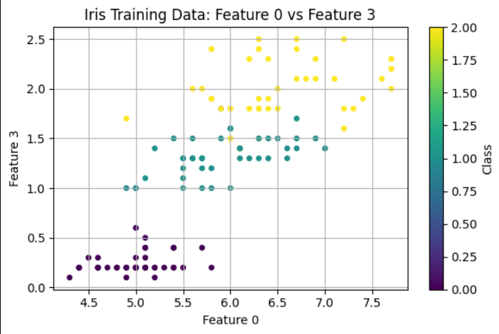

# 🌸 Iris Dataset Visualization & Preprocessing  
(پیش‌پردازش و تجسم دیتاست آیریس)

---

## 📚 About the Project | درباره پروژه

The Iris dataset is a classic and very popular dataset in machine learning and data science. It contains 150 samples of iris flowers from three species (Setosa, Versicolour, and Virginica). Each sample has four features: sepal length, sepal width, petal length, and petal width.

این پروژه شامل بارگذاری دیتاست آیریس، تقسیم داده‌ها به دو بخش آموزش و تست، نرمال‌سازی داده‌ها با استفاده از MinMaxScaler، و رسم نمودار پراکندگی (scatter plot) دو ویژگی از دیتاست است.

This project demonstrates:
- Loading datasets with scikit-learn  
- Splitting data into training and test sets  
- Feature scaling with MinMaxScaler  
- Data visualization with Matplotlib

---

## 🧩 Dataset Features | ویژگی‌های دیتاست

| Feature Index | Feature Name    | شرح ویژگی            |
|---------------|-----------------|----------------------|
| 0             | Sepal Length    | طول کاسبرگ           |
| 1             | Sepal Width     | عرض کاسبرگ           |
| 2             | Petal Length    | طول گلبرگ            |
| 3             | Petal Width     | عرض گلبرگ            |

---

## 🔧 Technologies Used | تکنولوژی‌های استفاده شده

- Python 3.x  
- NumPy  
- Matplotlib  
- Scikit-learn

---

## 🚀 How to Run | نحوه اجرای پروژه

1. ابتدا پکیج‌های مورد نیاز را نصب کنید:

   ```bash
   pip install -r requirements.txt


نمودار:



## About Me | درباره من

👋 My name is **Abolfazl Karimi**. I am a professional AI programmer specializing in developing real-world machine learning and deep learning projects. I am passionate about advancing my skills and building a strong portfolio in artificial intelligence.  

📫 Contact me via Email: karimiabolfazl466@gmail.com  
📱 Telegram: [@Abolfazl83](https://t.me/Ablfazl83)   
🌐 LinkedIn: [***](***)  
🐙 GitHub: [github.com/abolfazlkarimi83](https://github.com/abolfazlkarimi83)

---

👋 من **ابوالفضل کریمی** هستم، برنامه‌نویس حرفه‌ای هوش مصنوعی با تخصص در توسعه پروژه‌های عملی یادگیری ماشین و یادگیری عمیق.  
علاقه‌مند به ارتقاء مهارت‌هایم و ساخت یک رزومه قوی در زمینه هوش مصنوعی هستم.

📫 ایمیل: karimiabolfazl466@gmail.com  
📱 تلگرام: [@AbolfazlKarimi](https://t.me/AbolfazlKarimi)  
🌐 لینکدین: [linkedin.com/in/abolfazl-karimi](https://linkedin.com/in/abolfazl-karimi)  
🐙 گیت‌هاب: [github.com/abolfazlkarimi83](https://github.com/abolfazlkarimi83)
